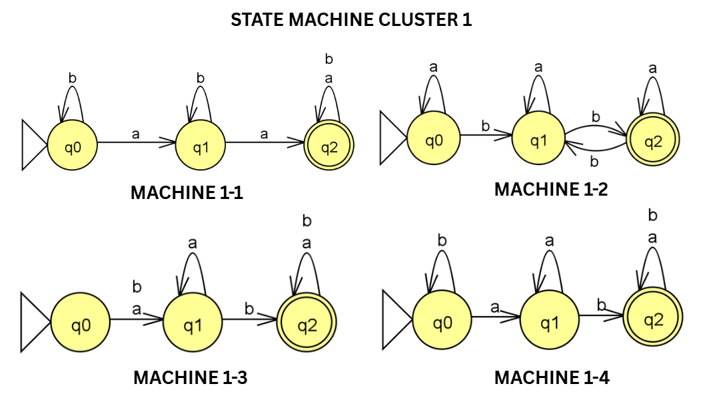
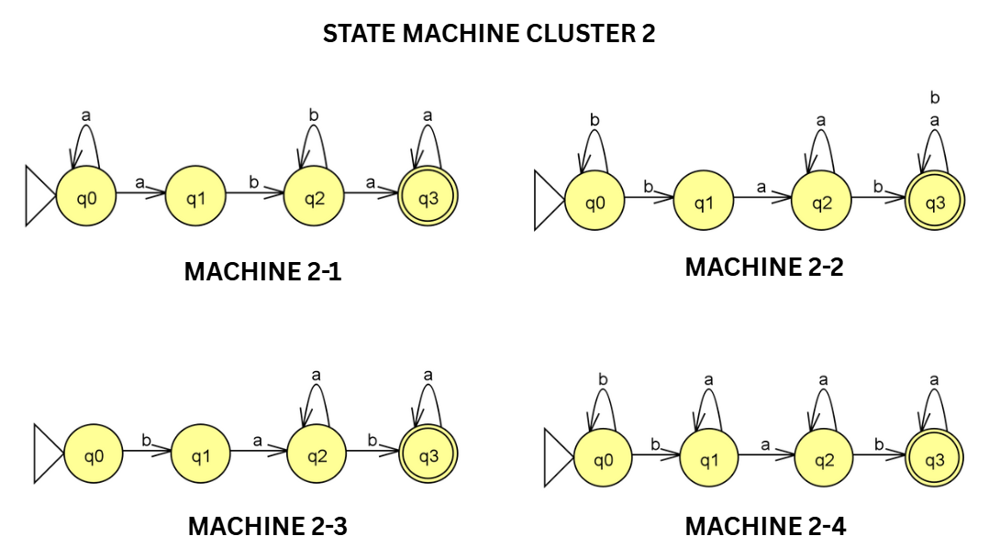
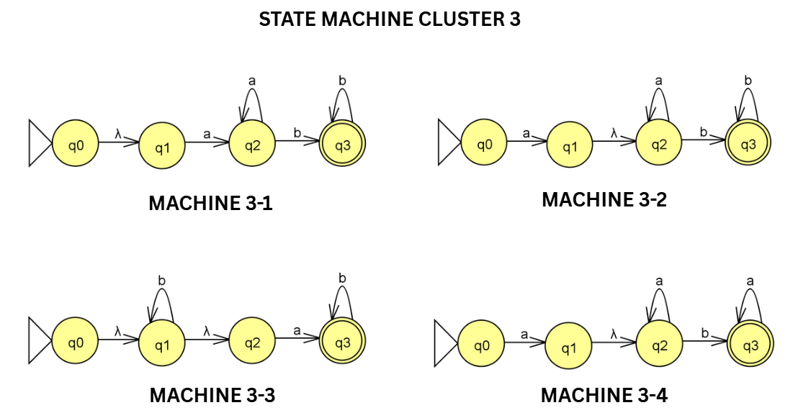
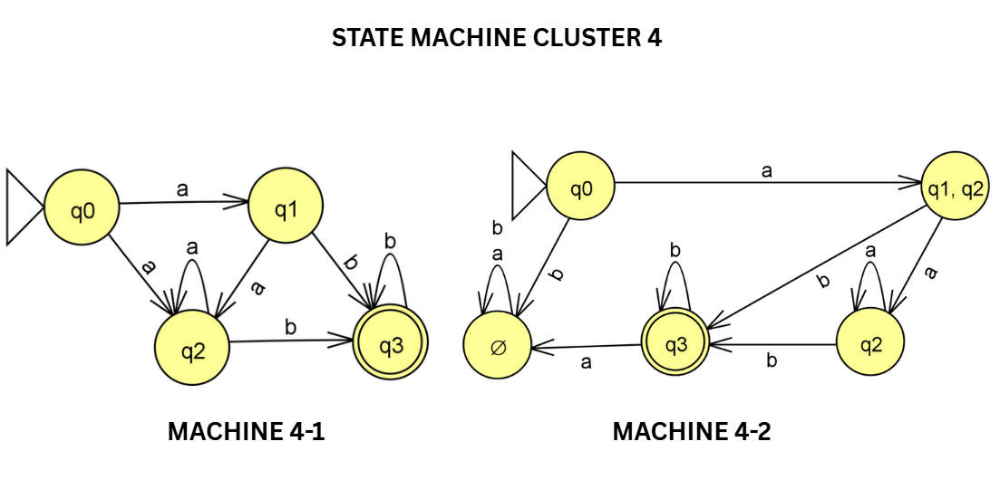
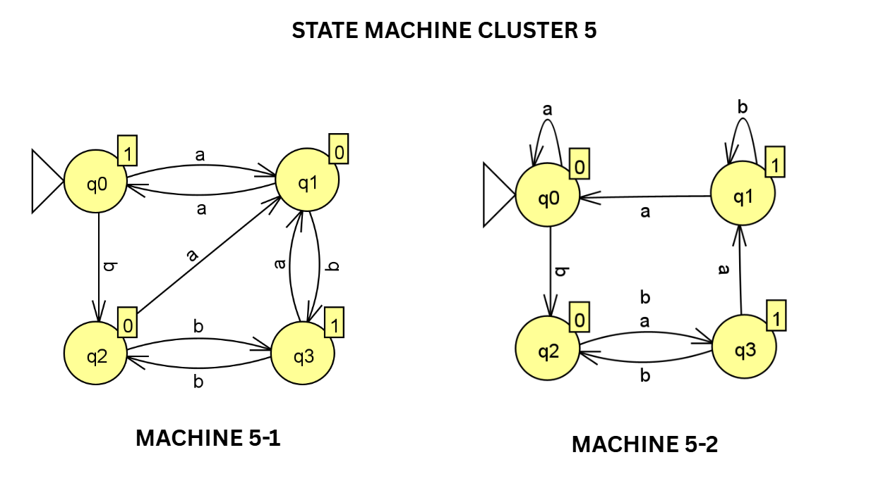
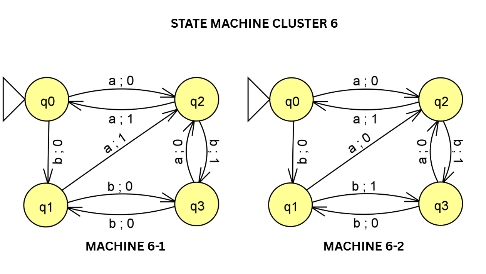
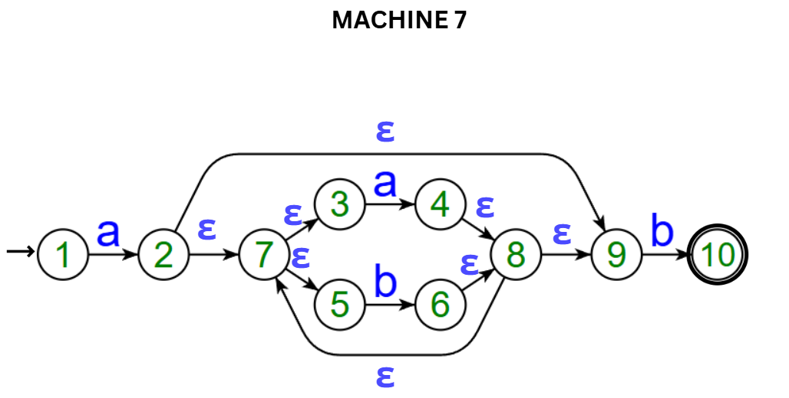
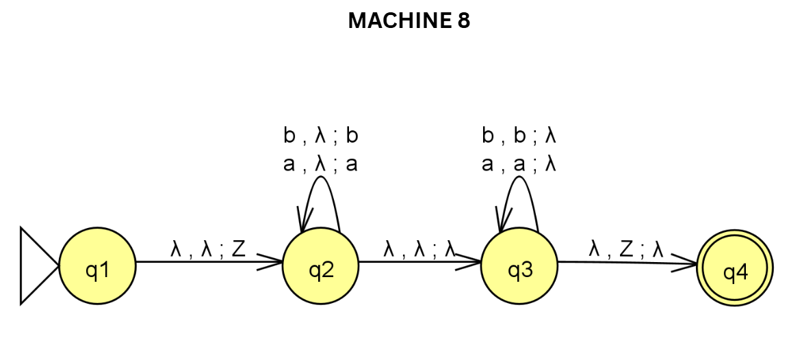

# CS0023: Automata Theory and Formal Languages

## Comprehensive Final Exam Reviewer & Test Bank

Computer Science Department

3TSY2526

## 1. Topical Concept Summaries

### 1.1 Mathematical Preliminaries & Relations

Languages are sets of strings, so set-builder notation is the most precise way to describe them. Cartesian products A × B produce ordered pairs, and the order matters. Relations are sets of ordered pairs; a relation becomes a function when every element of the domain has exactly one image. Directed graphs are a natural visual model for relations because an arrow x → y records the ordered pair (x, y).

### 1.2 Finite Automata Foundations

A DFA is defined by a finite set of states, an input alphabet, a deterministic transition function, a start state, and a set of final states. The key property is determinism: each state-symbol pair leads to exactly one next state. The extended transition function δ∗ tracks the effect of an entire string, not just one symbol. Transition diagrams use arrows for moves, a start arrow from nowhere, and double circles for accepting states.

### 1.3 Nondeterministic Finite Automata

An NFA generalizes the DFA by allowing zero, one, or many possible next states for a state-symbol pair. An ε-NFA adds empty-string moves, so the machine may change states without consuming input. The ε-closure of a state is the set of states reachable using only ε-moves. Subset construction converts an NFA to an equivalent DFA by treating each set of NFA states as one DFA state. Thompson’s construction is the standard method for turning a regular expression into an ε-NFA.

### 1.4 Regular Expressions

Regular expressions describe exactly the regular languages using union |, concatenation, and Kleene star ∗. Precedence matters: star binds strongest, concatenation comes next, and union is weakest. A regex may be translated into an automaton, and conversely many simple automata can be described compactly by a regex. The language intuition is central: a regex is not just a symbol pattern, but a formal description of a set of strings.

### 1.5 Product Automata Construction

The product construction combines two DFAs into one machine whose states are pairs (p, q). This is the standard closure proof for union and intersection of regular languages. For union, a pair is accepting if either component is accepting; for intersection, both components must be accepting. The new start state is the pair of the original start states, and each input symbol updates both components simultaneously.

### 1.6 Transducers: Moore and Mealy Machines

Transducers produce output while reading input. In a Moore machine, outputs are attached to states through λ : Q → ∆, so the initial state contributes an output before any input is read. In a Mealy machine, outputs are attached to transitions, so the output depends on the current state and the input symbol. Conversions between the two models preserve behavior but change where the outputs are recorded.

### 1.7 Chomsky Hierarchy & Grammars

The Chomsky hierarchy classifies grammars and their corresponding machines from Type-3 up to Type-0. Regular grammars correspond to finite automata, context-free grammars correspond to pushdown automata, and Type-0 grammars correspond to Turing machines. A CFG is written as G = (V, T, S, P) where V are variables, T are terminals, S is the start symbol, and P is the set of productions. Leftmost/rightmost derivations, parse trees, and ambiguity are core tools for understanding syntax.

### 1.8 CFG Simplification & Normal Forms

Grammar simplification removes useless symbols, unit productions, and null productions while preserving the language, usually except for the empty string if handled separately. Left recursion is eliminated to make top-down parsing and normal-form conversion easier. In Chomsky Normal Form, productions are restricted to A → BC or A → a; in Greibach Normal Form, productions begin with a terminal, as in A → aα. These normal forms are standard in proofs and parsing theory.

### 1.9 Pushdown Automata

A PDA is like an automaton with memory because it uses a stack. Its instantaneous description (q, w, s) records the current state, the unread input, and the stack contents. PDAs are especially useful for languages with nested or matched structure, such as palindromes and balanced brackets. Acceptance may be by final state, by empty stack, or both depending on the formal convention.

### 1.10 Turing Machines

A Turing machine is the most powerful standard model in this course. Its 7-tuple includes a tape alphabet Γ, a blank symbol, a transition function that can read, write, move left or right, and change state, plus final states for acceptance and rejection. The machine can revisit tape cells and overwrite symbols, giving it unbounded computational flexibility. This is why Turing machines sit at the top of the hierarchy of automata power.

## 2. Practice Test Bank (200 Questions)

### 2.1 1–20. Mathematical Preliminaries & Relations

1. Which set-builder notation describes the language of all binary strings that start with 0 and end with 1?

A. {x | x ∈ {0, 1}∗, x starts with 0 and ends with 1}

B. {x | x ∈ {0, 1}∗, x starts with 1 and ends with 0}

C. {x | x has exactly one 1}

D. {x | x contains no 0}

2. Let A = {p, q} and B = {0, 1}. Which element belongs to A × B?

A. (q, 1)

B. (1, q)

C. {q, 1}

D. (p, q)

3. Which relation from A = {1, 2, 3} to B = {a, b} is not a function?

A. {(1, a),(2, b),(3, a)}

B. {(1, a),(2, a),(3, b)}

C. {(1, a),(1, b),(2, a)}

D. {(1, b),(2, a),(3, b)}

4. In a transition digraph for a relation, what does the direction of an edge encode?

A. The order of the ordered pair

B. That the edge is always reversible

C. That the source vertex is accepting

D. That the graph has no cycles

5. Let L1 = {a, ab} and L2 = {b, ε}. Which string is in L1L2?

A. ab

B. ba

C. aa

D. bb

6. Which statement best describes a relation that is also a function?

A. Each input is paired with exactly one output

B. Each output is paired with exactly one input

C. Every pair has identical components

D. The relation must be symmetric

7. Which ordered pair is an element of B × A if A = {x, y} and B = {1, 2}?

A. (2, y)

B. (y, 2)

C. (x, 1)

D. (1, 3)

8. Which set-builder notation describes all strings over {0, 1} with exactly two 1s?

A. {x | x ∈ {0, 1}∗ and x has exactly two 1s}

B. {x | x ∈ {0, 1}∗ and x has at least two 1s}

C. {x | x ∈ {0, 1}∗ and x ends in 1}

D. {x | x ∈ {0, 1}∗ and x begins with 1}

9. Which of the following is a valid relation from {a, b} to {1, 2, 3}?

A. {(a, 1),(b, 2)}

B. {(1, a),(2, b)}

C. {(a, 1),(a, 2)}

D. {(a, 1),(b, 4)}

10. Which statement about a directed graph used to model a relation is correct?

A. Loops are impossible in every relation graph

B. Edges represent unordered pairs

C. An edge from u to v encodes (u, v)

D. Every vertex must have out-degree 1

11. Let L1 = {0, 1} and L2 = {a, b}. Which string is in L1L2?

A. 0a

B. ab

C. 1a

D. All of the above

12. Which pair is NOT in the Cartesian product {m, n} × {x, y}?

A. (m, x)

B. (n, y)

C. (x, m)

D. (m, y)

13. Which relation is a function from {1, 2, 3} to {a, b}?

A. {(1, a),(2, b),(3, b)}

B. {(1, a),(2, b),(2, a)}

C. {(1, a),(3, b)}

D. {(1, a),(1, b),(2, b)}

14. Which set-builder notation describes all binary strings that contain at least one 0?

A. {x | x ∈ {0, 1}∗ and x contains at least one 0}

B. {x | x ∈ {0, 1}∗ and x contains exactly one 0}

C. {x | x ∈ {0, 1}∗ and x starts with 0}

D. {x | x ∈ {0, 1}∗ and x ends with 1}

15. Which relation from {u, v, w} to {r, s} is a function?

A. {(u, r),(v, s),(w, r)}

B. {(u, r),(u, s),(w, r)}

C. {(u, r),(v, s),(v, r)}

D. {(u, r),(v, s),(w)}

16. If L1 = {ε, a} and L2 = {b}, which string is in L1L2?

A. b

B. a

C. ε

D. abb

17. Which statement best explains why (2, q) is an ordered pair while {2, q} is not?

A. Order matters in pairs, but not in sets

B. Pairs must contain symbols from the same set

C. Sets are always infinite

D. Pairs cannot contain numbers

18. Which set-builder notation matches all strings over {a, b} that end in aa?

A. {x | x ∈ {a, b}∗ and x ends in aa}

B. {x | x ∈ {a, b}∗ and x begins in aa}

C. {x | x ∈ {a, b}∗ and x has exactly two as}

D. {x | x ∈ {a, b}∗ and x contains no b}

19. Which of the following is an element of {0, 1}2?

A. (0, 1)

B. 01

C. {0, 1}

D. (1, 1, 0)

20. Which statement about relations is correct?

A. Every function is a relation

B. Every relation is a function

C. Every relation must be symmetric

D. Every function must be bijective

### 2.2 21–40. Finite Automata Foundations

21. A DFA is deterministic because for each state and input symbol, the transition function returns

A. exactly one next state

B. zero or more next states

C. a pair of state and output

D. an ε-closure δ∗(q

22. If δ(q0, 0) = q1 and δ(q1, 1) = q2, what is δ∗(q0, 01)?

A. q0

B. q1

C. q2

D. {q2}

23. In a transition diagram, the node with an incoming arrow from nowhere is the

A. accepting state

B. start state

C. trap state

D. final state only if double-circled

24. What does a double circle denote in a DFA diagram?

A. A rejecting state

B. A start state

C. An accepting state

D. A dead transition

25. If δ(q, a) = q for all inputs a, then q is best described as a

A. trap state

B. start state

C. final state

D. non-deterministic state

26. Which expression correctly defines the extended transition function of a DFA?

A. δ : Q × Σ → Q

B. δ : Q × Σ → 2^Q

C. δ : Q → Σ

D. δ : Q × Σ → Q × ∆

27. What is the value of δ∗(q, ε) for any state q?

A. q

B. ε

C. ∅

D. {q}

28. Two DFAs are equivalent if they

A. have the same number of states

B. accept the same language

C. share the same start state label

D. use the same alphabet symbol order

29. In a DFA, every state-symbol pair must have

A. exactly one transition

B. at least two transitions

C. no transition

D. an ε transition

30. If a transition is not shown in a complete DFA, it usually goes to a

A. start state

B. trap state

C. final state

D. new alphabet symbol

31. If δ(q0, 1) = q1 and δ(q1, 0) = q0, what is δ∗(q0, 10)?

A. q0

B. q1

C. {q0, q1}

D. ∅

32. Which statement about a DFA transition graph is correct?

A. Edges are undirected

B. Each edge represents an ordered move on one symbol

C. Every accepting state has no outgoing edges

D. Loops are forbidden

33. What does the notation δ∗ represent in automata theory?

A. The set of all states

B. The extended transition function on strings

C. The output function of a Mealy machine

D. The stack alphabet of a PDA

34. Which of the following is a valid DFA acceptance criterion?

A. The machine ends in any state

B. The machine ends in an accepting state after consuming the whole input

C. The machine visits at least one final state

D. The machine must use an ε-move

35. If a DFA processes a string and reaches a trap state before the input ends, the string will

A. always be accepted

B. always be rejected

C. be accepted if the remaining symbols are all 1s

D. be accepted if the trap state is final

36. In the formal DFA definition (Q, Σ, δ, q0, F), the set F denotes

A. the set of final states

B. the alphabet

C. the transition relation

D. the stack symbols

37. Which string is accepted by a DFA for binary strings ending in 1?

A. 101

B. 100

C. 000

D. ε

38. If a transition diagram has one start state and one final state, the machine may still have

A. multiple outgoing transitions on the same symbol

B. no states

C. only ε-moves

D. no alphabet

39. Which statement best describes δ(q0 , 11) in a DFA?

A. Apply the transition once using the first 1 only

B. Apply δ twice, once for each symbol

C. Jump directly to the final state

D. Convert the DFA into an NFA

40. A DFA can be viewed as a special case of an NFA because

A. it uses ε-moves

B. its next-state set always has one element

C. it has a stack

D. it produces output symbols

### 2.3 41–64. Nondeterministic Finite Automata

41. In an NFA, δ(q, a) may contain

A. exactly one state

B. zero, one, or many states

C. only the start state

D. only final states

42. Which transition-function type is correct for an NFA?

A. Q × Σ → Q

B. Q × Σ → 2Q

C. Q → 2Q

D. Q × Σ → Q × ∆

43. Which automaton may move without consuming input symbols?

A. DFA

B. NFA

C. ε-NFA

D. TM

44. In Thompson’s construction, a union fragment is typically built using

A. parallel branches that later rejoin

B. one single linear path only

C. a stack

D. a tape head

45. In an NFA, δ(q, a) returns

A. one state

B. a subset of states

C. an output symbol

D. a stack string

46. Which feature distinguishes an NFA from a DFA?

A. Multiple possible next states on one symbol

B. Use of a tape alphabet

C. Use of output symbols

D. Mandatory acceptance of ε

47. The formal transition function of an NFA is usually written as

A. Q × Σ → Q

B. Q × Σ → 2Q

C. Q → Σ

D. Q × Σ → Q × ∆

48. An ε-NFA differs from an NFA because it

A. can move without consuming input

B. must be deterministic

C. cannot have final states

D. produces an output string

49. If a state has only an outgoing ε-move to itself, its ε-closure is

A. the empty set

B. only itself

C. all states in the machine

D. the set of final states

50. If p ε−→ r and r ε−→ s, then s belongs to the ε-closure of

A. only s

B. only r

C. p

D. the alphabet

51. In subset construction, the start state of the new DFA is the

A. set of all final states

B. ε-closure of the NFA start state

C. next state after one symbol

D. largest state label

52. If q has no outgoing ε-moves, then ε-closure(q) is

A. ∅

B. {q}

C. all states

D. the accepting set

53. Machine 7 is an ε-NFA built using Thompson’s construction. Its underlying regex structure is most consistent with

A. a(a|b)∗b

B. a∗b∗

C. (ab)∗

D. b(a|b)∗a

54. Which string is accepted by Machine 7?

A. ab

B. baa

C. bbb

D. ε

55. Which string is NOT accepted by Machine 7?

A. aabb

B. ab

C. aaab

D. abab

56. Which operation is represented by the parallel branching in a Thompson NFA?

A. Union

B. Concatenation

C. Intersection

D. Complement

57. Subset construction is used to convert

A. DFA to NFA

B. NFA to DFA

C. PDA to TM

D. CFG to GNF

58. Which DFA state in subset construction corresponds to an NFA-state set?

A. A single original NFA state only

B. A subset of NFA states

C. An output alphabet symbol

D. An empty stack

59. If an NFA has a branching transition on a to two states, the equivalent DFA will

A. discard one branch

B. encode both possibilities in one state label

C. require two start states

D. become a PDA

60. Thompson’s construction is primarily used to convert

A. regex to ε-NFA

B. PDA to DFA

C. grammar to TM

D. relation to graph

61. Which prefix is sufficient to place Machine 7 on a path that can still accept later?

A. a

B. b

C. ε

D. bb

62. Which suffix must appear in every string accepted by Machine 7?

A. a

B. b

C. aa

D. ε

63. If the a and b labels inside Machine 7 are swapped, the machine would most directly recognize

A. a different regular language with the same structure

B. a context-free language

C. an arbitrary TM language

D. only palindromes

64. In the language accepted by Machine 7, the empty string is

A. accepted

B. rejected

C. accepted only after minimization

D. accepted only by the trap state

### 2.4 65–84. Regular Expressions

65. In a regular expression, the operator with highest precedence among |, concatenation, and ∗ is

A. Union

B. Concatenation

C. Kleene star

D. None of the above

66. Which string matches a∗b∗?

A. aaabbb

B. abab

C. ba

D. aaba

67. Which string belongs to (0|1)∗1?

A. 101

B. 000

C. ε

D. 1110

68. The regex (x|y)∗ describes

A. exactly one symbol

B. zero or more symbols each equal to x or y

C. only the string xy

D. all strings of length 2

69. Which pattern describes all strings over {a, b} that end in ab?

A. ab∗

B. (a|b)∗ab

C. a∗b∗

D. a|b

70. Which string is in the language of b∗ab∗?

A. baab

B. bbabb

C. aab

D. bbb

71. The regex 0(1|0)1 generates

A. 001

B. 010

C. 011

D. 101

72. Which of the following is equivalent to (ab)∗?

A. All strings of a’s then b’s

B. Repetitions of the block ab

C. Strings ending in a

D. Strings with at least one a

73. In regex syntax, a union symbol | means

A. concatenation

B. choice between alternatives

C. repetition

D. intersection

74. Which string is NOT in (0|1)∗0?

A. 10

B. 1010

C. 111

D. 000

75. The language of a∗ba∗ is

A. strings with exactly one b

B. strings with at least two b’s

C. strings with no a’s

D. strings ending in b

76. Which string is generated by (a|b)a(a|b)?

A. aaa

B. bab

C. bbb

D. baaab

77. Which pattern matches all strings containing at least one 1?

A. 0∗1 followed by anything

B. 1∗

C. (0|1)∗1(0|1)∗

D. 0∗1∗

78. The regex (ab|ba) accepts

A. exactly the strings ab and ba

B. all strings of length 2

C. only strings beginning with a

D. the empty string

79. Which string is in a∗b(a|b)∗?

A. bbb

B. aababa

C. aaaa

D. ε

80. Which of these is a valid regular expression under the usual precedence rules?

A. a|bc∗

B. a|b

C. ab|

D. ∗ab

81. The expression (0|1)(0|1) describes

A. all binary strings of length 2

B. all binary strings of length at most 2

C. strings with exactly one 0

D. strings ending in 1

82. Which string is NOT in a∗b∗?

A. aaabbb

B. ab

C. ba

D. ε

83. Which regular expression is most suitable for strings that begin with a and end with b?

A. a∗b∗

B. a(a|b)∗b

C. b(a|b)∗a

D. (a|b)∗

84. Which property is shared by all regular expressions?

A. They define regular languages

B. They define context-free languages only

C. They require stacks

D. They must contain ε

### 2.5 85–104. Product Automata Construction

85. For the product construction of two DFAs, the start state of the combined automaton is

A. the pair of the two start states

B. any accepting pair

C. the empty set

D. the trap state only

86. In the product automaton for L1 ∪ L2 , a pair (p, q) is accepting when

A. both p and q are accepting

B. at least one of p or q is accepting

C. neither is accepting

D. only p is accepting

87. In the product automaton for L1 ∩ L2 , a pair (p, q) is accepting when

A. either component is accepting

B. both components are accepting

C. exactly one component is accepting

D. both components are non-accepting

88. If L1 and L2 are regular, then L1 ∪ L2 is

A. regular

B. context-free but not regular

C. non-regular

D. undefined

89. If L1 and L2 are regular, then L1 ∩ L2 is

A. regular

B. always empty

C. never regular

D. only regular when the alphabets differ

90. In a product construction, the transition on symbol a from (p, q) is

A. (δ1(p, a), δ2(q, a))

B. (δ1(p, a), δ1(q, a))

C. (p, q, a)

D. (δ1(p), δ2(q))

91. Which statement about the union product automaton is correct?

A. The final state condition uses OR

B. The final state condition uses AND

C. The start state is a final state by default

D. The alphabet becomes empty

92. Which statement about the intersection product automaton is correct?

A. The final state condition uses OR

B. The final state condition uses AND

C. It cannot be deterministic

D. It always has two start states

93. Machine 1-1 and Machine 1-2 are combined using product construction. The new start state is

A. (q0, q0)

B. (q1, q1)

C. (q2, q2)

D. (q0, q1)

94. When constructing L1 ∪ L2 from two DFAs, the pair state that is final if only the first DFA accepts is

A. final

B. not final

C. undefined

D. the trap state

95. When constructing L1 ∩ L2 from two DFAs, the pair state that is final if only the first DFA accepts is

A. final

B. not final

C. always final

D. the start state

96. Product automata are especially useful because they help prove closure under

A. union and intersection

B. palindromes

C. stack operations

D. halting

97. If a pair state (p, q) appears in the product automaton, then it represents

A. two states being processed together

B. a single state duplicated

C. an output pair

D. a grammar production

98. The combined automaton for two DFAs has alphabet

A. the union of the original alphabets, if aligned

B. the Cartesian product of alphabets

C. no alphabet

D. only ε

99. Which operation determines final states in the product automaton for union?

A. OR

B. AND

C. XOR

D. NOT

100. Which operation determines final states in the product automaton for intersection?

A. OR

B. AND

C. XOR

D. NOT

101. If both original DFAs are complete, the product automaton will be

A. complete

B. incomplete

C. an NFA

D. a PDA

102. The product construction can also be adapted to prove closure of regular languages under

A. difference

B. complement via swapping final and nonfinal states

C. both of these

D. neither

103. Which pair-state criterion corresponds to L1 \ L2?

A. p final and q nonfinal

B. both final

C. either final

D. both nonfinal

104. Which of the following is the most direct reason product automata are called ’product’?

A. They use multiplication of symbols

B. The state space is a Cartesian product of state sets

C. They output products

D. They always have two tapes

### 2.6 105–124. Transducers: Moore & Mealy Machines

105. A Moore machine associates its output with

A. the current state only

B. each transition only

C. the input tape only

D. the accept state only

106. A Mealy machine associates its output with

A. the current state only

B. each transition

C. the stack

D. the blank symbol

107. In Machine 5-1, the output function value λ(q0) is

A. 0

B. 1

C. a

D. b

108. In Machine 5-1, the output alphabet is

A. {a, b}

B. {0, 1}

C. {q0, q1, q2, q3}

D. {ε}

109. In Machine 5-2, why is the machine classified as Mealy rather than Moore?

A. Outputs appear on transitions

B. Outputs appear only on states

C. It has no states

D. It uses ε-moves

110. When converting a Moore machine to a Mealy machine, the output on a transition is typically taken from

A. the source state

B. the destination state

C. the alphabet symbol

D. the start arrow

111. In a Moore machine, the produced output sequence is usually

A. one symbol shorter than the input

B. one symbol longer than the input by the initial output

C. always the same length as the input

D. always empty

112. Which statement about Machine 5-1 is correct?

A. It is a Moore machine

B. It is a Mealy machine

C. It is a PDA

D. It is a TM

113. Which statement about Machine 5-2 is correct?

A. It is a Moore machine

B. It is a Mealy machine

C. It is an NFA

D. It is a TM

114. The main distinction between Moore and Mealy machines is whether outputs depend on

A. states or transitions

B. tape symbols or stack symbols

C. start state or final state

D. alphabet size or number of states

115. If a Moore machine begins in state q0 with λ(q0) = 1, then before any input is read the output starts with

A. 1

B. 0

C. a

D. nothing at all

116. Which label format is characteristic of a Mealy transition in the diagrams?

A. a;0

B. 0 : a

C. q0 → q1

D. λ(q0) = 1

117. In Machine 6-1, the label format on edges such as a;0 means

A. read a and output 0

B. read 0 and output a

C. output happens before input

D. the transition is undefined

118. A Mealy machine can be converted to a Moore machine by

A. splitting states according to output values

B. removing all transitions

C. adding a stack

D. changing the alphabet to ε

119. When multiple transitions into the same state produce different outputs in a Moore conversion, the usual fix is to

A. duplicate the state

B. delete the state

C. merge the alphabet

D. make the machine nondeterministic

120. In Machine 5-1, the output associated with state q2 is

A. 0

B. 1

C. a

D. b

121. In Machine 5-2, the output associated with state q3 is

A. 0

B. 1

C. a

D. b

122. The output of a Moore machine depends on

A. the current state after each input step

B. the next input symbol only

C. the entire future input

D. the stack top

123. A key advantage of Moore machines in practice is that outputs are often

A. more stable because they change only when the state changes

B. less stable because they are attached to symbols

C. impossible to compute

D. always longer than the input by 10 symbols

124. Type-2 languages in the Chomsky hierarchy are recognized by

A. finite automata

B. pushdown automata

C. Turing machines

D. none of the above

### 2.7 125–144. Chomsky Hierarchy & Grammars

125. A context-free grammar is formally a 4-tuple

A. (Q, Σ, δ, q0)

B. (V, T, S, P)

C. (Q, Γ, F)

D. (L, R, λ)

126. In a CFG, T denotes

A. terminals

B. nonterminals

C. the start symbol

D. the set of productions

127. In a leftmost derivation, each step expands the

A. rightmost nonterminal

B. leftmost nonterminal

C. leftmost terminal

D. last production only

128. In a parse tree, the leaves are labeled by

A. only nonterminals

B. terminals or λ

C. only the start symbol

D. state names

129. Context-free languages are not closed under

A. union

B. concatenation

C. intersection

D. Kleene star

130. A grammar production of the form A → B is called a

A. null production

B. unit production

C. terminal production

D. left-recursive production

131. A useless symbol is one that is

A. either non-generating or unreachable

B. always terminal

C. always the start symbol

D. always nullable

132. Which automaton is associated with Type-0 languages?

A. FA

B. PDA

C. LBA

D. TM

133. Which automaton is associated with Type-3 languages?

A. FA

B. PDA

C. TM

D. LBA

134. An ambiguous grammar is one that

A. has more than one parse tree for some string

B. contains an ε-production

C. has no terminals

D. is always regular

135. The start symbol of a grammar is usually denoted by

A. S

B. T

C. Q

D. F

136. Which of the following can be derived by a CFG?

A. palindromic patterns and nested structures

B. only finite languages

C. only right-linear languages

D. only unary strings

137. A rightmost derivation expands the

A. leftmost nonterminal

B. rightmost nonterminal

C. leftmost terminal

D. start symbol only

138. Which statement best describes a parse tree?

A. It records one derivation structure for a string

B. It is the same as a DFA diagram

C. It lists all terminals in alphabetical order

D. It cannot represent ambiguity

139. Which closure property holds for CFLs?

A. Union

B. Intersection

C. Complement

D. Difference

140. Which of these is a terminal symbol set in a CFG?

A. the alphabet of strings produced by the grammar

B. the set of variables

C. the set of states

D. the set of tape symbols

141. Which statement about a CFG production is valid?

A. Productions can replace a variable with a string of terminals and variables

B. Productions must be a single symbol only

C. Productions must be reversible

D. Productions cannot include terminals

142. In the Chomsky hierarchy, each higher type is generally

A. less powerful

B. more powerful

C. identical

D. undefined

143. Which language class is most closely tied to nested parentheses?

A. Regular languages

B. Context-free languages

C. Finite languages only

D. All recursive languages only

144. A null production is one of the form

A. A → λ

B. A → B

C. A → a

D. AB → C

### 2.8 145–164. CFG Simplification & Normal Forms

145. Left recursion occurs when a production begins with the

A. same nonterminal on the left side

B. empty string

C. start symbol only

D. terminal symbol only

146. Chomsky Normal Form allows productions of the forms

A. A → BC or A → a

B. A → aB

C. A → λ only

D. A → Ba

147. Greibach Normal Form requires productions of the form

A. A → BC

B. A → aα

C. A → λ only

D. A → B

148. A production of the form A → B is removed during simplification as a

A. unit production

B. null production

C. terminal production

D. regular production

149. A symbol that cannot derive any terminal string is

A. non-generating

B. reachable

C. nullable

D. productive

150. A symbol that cannot be reached from the start symbol is

A. unreachable

B. nullable

C. terminal

D. deterministic

151. The first step in many CNF conversions is to ensure the start symbol does not appear on the right-hand side by

A. introducing a new start symbol

B. removing all terminals

C. adding more unit productions

D. converting to a PDA

152. When removing null productions, the general goal is to

A. preserve all non-empty strings

B. destroy the grammar

C. eliminate every terminal

D. force left recursion

153. Which rule is already in CNF?

A. A → BC

B. A → aB

C. A → λ (non-start)

D. A → Ba

154. Which rule is already in GNF?

A. A → aBC

B. A → BC

C. A → aB

D. A → λ

155. If a grammar has a left-recursive rule A → Aa, an equivalent non-left-recursive form introduces

A. a new helper nonterminal

B. a new tape symbol

C. a new final state

D. a new stack marker

156. Useless symbols should be removed because they

A. do not affect the generated language

B. always make the grammar regular

C. are required for CNF

D. convert CFGs into DFAs

157. A grammar in CNF is useful because it simplifies

A. formal parsing arguments

B. TM halting proofs

C. graph coloring

D. stack initialization

158. A grammar in GNF is especially convenient for showing correspondence with

A. pushdown automata

B. finite automata

C. Turing machines

D. relations

159. A production A → aB violates CNF because

A. it mixes a terminal and a variable

B. it has too many terminals

C. it is unit

D. it has no start symbol

160. After eliminating unit productions, the grammar becomes

A. more compact but language-equivalent

B. non-equivalent

C. non-grammar

D. a DFA

161. Which of the following is not a simplification step for CFGs?

A. removing useless symbols

B. removing unit productions

C. removing null productions

D. adding new unrelated terminals

162. Which normal form forces each derivation step to begin with a terminal?

A. CNF

B. GNF

C. DFA normal form

D. Moore form

163. Which statement about CNF and GNF is correct?

A. Both are equivalent normal forms for CFGs up to standard language restrictions

B. Only CNF applies to regular languages

C. Only GNF applies to Turing machines

D. Neither preserves the language

164. Machine 8 is best described as a PDA for recognizing

A. even-length palindromes over {a, b}

B. strings ending in 0

C. binary strings with exactly one 1

D. all regular languages

### 2.9 165–184. Pushdown Automata

165. In the instantaneous description (q, w, s) of a PDA, w denotes

A. the unread portion of the input

B. the input already read

C. the stack alphabet

D. the final state

166. In an ID triplet (q, w, s), s denotes

A. the stack contents

B. the start state

C. the set of final states

D. the current output

167. The transition λ, λ; λ from q2 to q3 in Machine 8 represents

A. a nondeterministic guess of the midpoint

B. pushing the first symbol

C. reading the last symbol

D. accepting immediately

168. In Machine 8, the loops on q2 are used to

A. push the first half of the string onto the stack

B. pop the stack

C. empty the tape

D. accept only the empty string

169. In Machine 8, the loops on q3 are used to

A. match and pop symbols from the stack

B. push more input symbols

C. move to the start state

D. create new tape cells

170. If a PDA transition is δ(q, 0, A) = {(p, BA)}, then the machine

A. replaces A with BA

B. deletes A only

C. writes 0 to the tape

D. accepts immediately

171. The stack gives a PDA additional power over a DFA because it provides

A. unbounded memory

B. a second input tape

C. more final states

D. multiple alphabets only

172. Which string is accepted by Machine 8?

A. baab

B. baba

C. abb

D. abbb

173. Which string is rejected by Machine 8?

A. abba

B. baab

C. abab

D. bb

174. After reading the first three symbols of ababaa in Machine 8, the stack top is most likely

A. a

B. b

C. Z

D. empty

175. In Machine 8, the symbol Z most naturally represents

A. the initial stack marker

B. the input alphabet

C. the accepting state

D. the blank tape symbol

176. A PDA can recognize palindromes because it can

A. push a first half and compare a reversed second half

B. sort symbols alphabetically

C. count only one symbol

D. erase the input tape

177. Which of the following is an instantaneous description, not a transition?

A. (q, abb, Zaa)

B. δ(q, a, A)

C. q0 → q1

D. a;0

178. Machine 8 accepts after the stack becomes

A. reduced back to Z and the input is fully read

B. equal to the input alphabet

C. empty before reading anything

D. larger than the input

179. Which of these is a standard PDA move type?

A. push, pop, or replace top symbol

B. swap tape halves

C. reverse the input

D. relabel states alphabetically

180. The empty move in a PDA is often written as

A. λ

B. Σ

C. Γ

D. F

181. Which language is a classic PDA language but not regular?

A. {anbn n ≥ 0}

B. {a∗b∗}

C. {ab}

D. ∅

182. The decisive difference between DFA and PDA behavior is that a PDA can

A. consult its stack while processing input

B. change the alphabet on the fly

C. move two cells at once

D. always be minimized

183. If Machine 8 were modified to push symbols a and b in the first half and pop them in reverse order, it would still recognize

A. palindromes over {a, b}

B. only even numbers

C. all regular languages

D. nothing useful

184. In the formal 7-tuple for a TM, (Q, Σ, Γ, δ, q0, b, F), the symbol Γ denotes

A. the tape alphabet

B. the input alphabet

C. the set of final states

D. the transition direction

### 2.10 185–200. Turing Machines

185. The component b in a TM 7-tuple is the

A. blank symbol

B. boundary marker only

C. accept state

D. input head

186. The function δ(q, a) → (p, y, D) means the machine

A. reads a, writes y, moves D, and enters p

B. writes a, reads y, and moves D

C. moves D first, then writes p

D. switches to a new alphabet

187. Which of the following is not one of a TM’s basic abilities?

A. Read the current tape symbol

B. Write a symbol

C. Move the head left or right

D. Use an unbounded stack

188. Machine 9 accepts strings of the form

A. 01∗0

B. 10∗1

C. 0∗1∗

D. 1∗01∗

189. Which string is accepted by Machine 9?

A. 010

B. 100

C. 0110

D. 0011

190. Which string is rejected by Machine 9?

A. 00

B. 010

C. 0110

D. 01010

191. In Machine 9, state q1 primarily processes

A. the block of 1s between two 0s

B. the initial blank tape

C. the accept state only

D. the final 0 only

192. In Machine 9, the transition 0;x,R from q0 means

A. read 0, write x, move right

B. read x, write 0, move left

C. write 0, then read x

D. move left without writing

193. A Turing machine may move its head

A. left or right by one cell per transition

B. two cells per transition only

C. only right

D. only on blank cells

194. The halting states of Machine 9 are labeled

A. ACCEPT and REJECT

B. START and STOP

C. YES and NO

D. FINAL and DEAD

195. Which statement about Turing-machine power is correct?

A. TM ¿ PDA ¿ FA

B. FA ¿ PDA ¿ TM

C. PDA ¿ TM ¿ FA

D. All are equally powerful

196. A TM is considered a general model of computation because it can

A. simulate simpler machines and perform unbounded work

B. only recognize regular languages

C. only use one state

D. never halt

197. In Machine 9, reaching the REJECT state usually means the machine has

A. found an invalid pattern or impossible move

B. accepted the input

C. entered a final stack state

D. converted to a DFA

198. Which move direction symbols are commonly used in TM descriptions?

A. L and R

B. U and D

C. A and B

D. 0 and 1

199. If a TM writes a symbol and then moves right, the tape head advances to

A. the next cell to the right

B. the same cell

C. the leftmost cell always

D. the accept state

200. Which statement best describes a halting computation?

A. The machine enters ACCEPT or REJECT and stops

B. The machine must continue forever

C. The tape becomes empty

D. The input must be a palindrome

## 3. Comprehensive Answer Key & Explanations

### 3.1 1–20. Mathematical Preliminaries & Relations

1. Answer: A. The set-builder description must match both boundary conditions: first symbol 0 and last symbol 1. The other choices describe different properties.

2. Answer: A.ACartesianproductelementmustbeanorderedpairwhosefirstcomponent comes from A and whose second component comes from B.

3. Answer: C. A function cannot assign two different outputs to the same input. Choice C assigns both a and b to 1.

4. Answer: A. A directed edge from x to y represents the ordered pair (x, y), so order matters.

5. Answer: A. Since a ∈ L and ε ∈ L , concatenation gives aε = a, and abε = ab. Among 1 2 the options, ab is valid.

6. Answer: A. A function is a special relation where each domain element has exactly one image.

7. Answer: A. For B × A, the first component must come from B and the second from A.

8. Answer: A. Exactly two 1s means the count of symbol 1 is fixed at two, not at least two or boundary-based.

9. Answer: A. The first component must come from the first set and the second component from the second set.

10. Answer: C. Directed graphs preserve order, so an arrow from u to v stands for the ordered pair (u, v).

11. Answer: D. Each string is formed by taking one symbol from L1 followed by one from L2, so all listed strings belong to the concatenation.

12. Answer: C. The first component must be from the first set and the second from the second set. (x, m) reverses the order.

13. Answer: A. Choice A assigns exactly one output to each input in the domain.

14. Answer: A. The property is existential: at least one 0 appears anywhere in the string.

15. Answer: A. Each input appears once on the left, so every domain element has a unique image.

16. Answer: A. Concatenating ε with b gives b, so b is in the product.

17. Answer: A. A Cartesian product uses ordered pairs. Sets ignore order and do not record first-versus-second component information.

18. Answer: A. The suffix condition is the key property: the last two symbols are both a.

19. Answer: A. {0, 1}2 is the set of ordered pairs whose components are each drawn from {0, 1}.

20. Answer: A. A function is a special case of a relation, so every function is indeed a relation.

### 3.2 21–40. Finite Automata Foundations

21. Answer: A. Determinism means there is a single defined move from each state-symbol pair.

22. Answer: C. Read the first symbol 0 to move to q1, then read 1 to move to q2.

23. Answer: B. The arrow from nowhere marks the start state of the automaton.

24. Answer: C. Double circles conventionally indicate accepting (final) states.

25. Answer: A. A state that loops to itself on every symbol is a typical trap or sink state.

26. Answer: A. A DFA has a single next state for each state-symbol pair.

27. Answer: A. Reading the empty string leaves the automaton in the same state.

28. Answer: B. Equivalence is language-based, not state-count-based.

29. Answer: A. A DFA is complete and deterministic: one move for each state-symbol pair.

30. Answer: B. Missing transitions are commonly redirected to a sink/trap state in complete diagrams.

31. Answer: A. The first 1 moves to q1; the following 0 returns to q0.

32. Answer: B. Transition graphs are directed and symbol-labeled.

33. Answer: B. The star version extends δ from single symbols to whole strings.

34. Answer: B. A DFA accepts only if the input is exhausted and the final state is accepting.

35. Answer: B. A trap state is designed to reject every continuation.

36. Answer: A. The accept set is written as F.

37. Answer: A. A string ending in 1 satisfies the acceptance condition.

38. Answer: A. A DFA may have many outgoing edges overall, but not more than one per symbol from a given state.

39. Answer: B. Extended transition means processing one input symbol at a time through the whole string.

40. Answer: B. A DFA is an NFA whose transition set happens to be singleton-valued.

### 3.3 41–64. Nondeterministic Finite Automata

41. Answer: B. An NFA can branch to zero, one, or many states on the same input symbol.

42. Answer: B. An NFA can branch to zero, one, or many states on the same input symbol.

43. Answer: B. An NFA can branch to zero, one, or many states on the same input symbol.

44. Answer: C. An NFA can branch to zero, one, or many states on the same input symbol.

45. Answer: B. An NFA transition may branch to several states, so the codomain is a set of states.

46. Answer: A. Nondeterminism means one input symbol can lead to several possible moves.

47. Answer: B. The set-valued transition map records all possible next states.

48. Answer: A. An ε-NFA allows transitions labeled with the empty string.

49. Answer: B. The closure always contains the state itself and any states reachable by ε-moves.

50. Answer: C. Closure is transitive along chains of empty moves.

51. Answer: B. Subset construction begins with the empty-move closure of the NFA start state.

52. Answer: B. The closure still includes the state itself even when no empty transitions exist.

53. Answer: A. The diagram has an initial a branch, a middle union/star gadget, and a trailing b.

54. Answer: A. The machine accepts strings that begin with a and end with b, so ab is accepted.

55. Answer: D. abab ends in b but starts with a; however it does not fit the particular Thompson pattern shown because the middle gadget expects the branched sublanguage, not arbitrary alternation.

56. Answer: A. A split into two alternative paths is the automaton form of regex union.

57. Answer: B. The subset construction determinizes an NFA by treating sets of states as DFA states.

58. Answer: B. Each DFA state encodes a subset of NFA states reachable after reading the same input.

59. Answer: B. Determinization preserves all possibilities by bundling them into a set-state.

60. Answer: A. Thompson’s method systematically builds an ε-NFA from a regular expression.

61. Answer: A. The machine begins with an a transition before the internal branching.

62. Answer: B. The outer structure of Machine 7 ends with a b transition into the final state.

63. Answer: A. Swapping labels changes the language but not the regular-language nature of the automaton.

64. Answer: B. The machine requires at least one input symbol along the leading and trailing transitions.

### 3.4 65–84. Regular Expressions

65. Answer: C. The Kleene star applies to the immediately preceding expression before concatenation or union.

66. Answer: A. The pattern allows any number of a’s followed by any number of b’s.

67. Answer: A. The string must end in 1.

68. Answer: B. The star permits arbitrary repetition of either symbol.

69. Answer: B. The suffix ab must appear at the end, preceded by any string.

70. Answer: B. There is one central a with any number of b’s on both sides.

71. Answer: A. The middle symbol may be 1 or 0; the fixed ends are 0 and 1.

72. Answer: B. The expression repeats the two-symbol block ab.

73. Answer: B. The bar denotes a choice between the alternatives.

74. Answer: C. The string must end in 0; 111 ends in 1.

75. Answer: A. A single b may be surrounded by any number of a’s.

76. Answer: B. The middle symbol must be a and the outer symbols may be a or b.

77. Answer: C. The 1 may appear anywhere, with any binary prefix and suffix.

78. Answer: A. The union chooses either the block ab or the block ba.

79. Answer: B. The language requires one explicit b after any number of a’s, then any continuation.

80. Answer: A. The first is syntactically valid; the others misuse operators.

81. Answer: A. Two concatenated binary choices produce exactly length 2.

82. Answer: C. Once a b appears, no a may follow in this language.

83. Answer: B. The first and last symbols are fixed as a and b respectively.

84. Answer: A. By definition, regular expressions generate regular languages.

### 3.5 85–104. Product Automata Construction

85. Answer: A. The machine begins by tracking both original start states simultaneously.

86. Answer: B. Union accepts when either component accepts.

87. Answer: B. Intersection requires both languages to accept.

88. Answer: A. Regular languages are closed under union.

89. Answer: A. Regular languages are closed under intersection.

90. Answer: A. Each component machine advances on the same input symbol.

91. Answer: A. Union is implemented by accepting whenever either component accepts.

92. Answer: B. Intersection accepts only if both components accept.

93. Answer: A. Both component machines begin at their own start states.

94. Answer: A. Union accepts when at least one component is final.

95. Answer: B. Intersection requires both components to accept.

96. Answer: A. The construction is the standard closure proof for regular languages.

97. Answer: A. The pair tracks both original machines at once.

98. Answer: A. The product machine reads the same input symbols in both components.

99. Answer: A. At least one accepting component suffices.

100. Answer: B. Both components must accept.

101. Answer: A. Every component move is defined, so the pairwise move is also defined.

102. Answer: C. Difference and complement are also handled with product/marking ideas.

103. Answer: A. Set difference keeps strings accepted by the first language but rejected by the second.

104. Answer: B. The new state set is Q1 × Q2.

### 3.6 105–124. Transducers: Moore & Mealy Machines

105. Answer: A. In a Moore machine, the output function maps states to outputs.

106. Answer: B. Mealy outputs are produced on transitions, not on states.

107. Answer: B. The state label shown for q0 in Machine 5-1 is 1.

108. Answer: B. The state outputs are binary digits.

109. Answer: A. The diagram labels each transition with input/output pairs.

110. Answer: B. A common conversion uses the output of the state entered by that transition.

111. Answer: B. A Moore machine emits an output for the initial state before reading input, so the sequence has an initial offset.

112. Answer: A. Machine 5-1 labels outputs inside states, so it is Moore.

113. Answer: B. Machine 5-2 labels outputs on transitions, which is the Mealy convention.

114. Answer: A. Moore uses states; Mealy uses transitions.

115. Answer: A. Moore machines emit the initial state’s output immediately.

116. Answer: A. Mealy edges typically show input;output.

117. Answer: A. The semicolon separates input from output on the transition.

118. Answer: A. Each distinct output on incoming transitions often requires a distinct Moore state.

119. Answer: A. Different outputs require distinct output states.

120. Answer: A. The state label beside q2 is 0.

121. Answer: B. The state label beside q3 is 1.

122. Answer: A. Outputs are state-based and are emitted as the machine moves through states.

123. Answer: A. Because output depends on state, it is less sensitive to the exact transition edge taken.

124. Answer: B. Context-free languages correspond to pushdown automata.

### 3.7 125–144. Chomsky Hierarchy & Grammars

125. Answer: B. A CFG is written as (V, T, S, P).

126. Answer: A. The terminal alphabet is usually denoted by T.

127. Answer: B. Leftmost derivation always chooses the leftmost nonterminal.

128. Answer: B. Leaves correspond to the derived string, so they are terminals or the empty string.

129. Answer: C. CFLs are not closed under intersection.

130. Answer: B. One nonterminal rewriting to one nonterminal is a unit production.

131. Answer: A. Useless symbols fail to contribute to any terminal derivation.

132. Answer: D. Type-0 languages are exactly the recursively enumerable languages recognized by Turing machines.

133. Answer: A. Type-3 languages are regular languages, recognized by finite automata.

134. Answer: A. Ambiguity means a string has multiple distinct derivations or parse trees.

135. Answer: A. Standard CFG notation uses S for the start symbol.

136. Answer: A. CFGs are expressive enough for nested and recursive syntax.

137. Answer: B. Rightmost derivation always chooses the rightmost nonterminal.

138. Answer: A. A parse tree captures the hierarchical derivation of one generated string.

139. Answer: A. Context-free languages are closed under union.

140. Answer: A. Terminals are the symbols that appear in the generated strings.

141. Answer: A. CFG rules may rewrite a variable into a mixed string of terminals and nonterminals.

142. Answer: B. The hierarchy increases in expressive power from Type-3 up to Type-0.

143. Answer: B. Nested matching is a classic CFL/PDA behavior.

144. Answer: A. A null production derives the empty string.

### 3.8 145–164. CFG Simplification & Normal Forms

145. Answer: A. Left recursion has the same nonterminal appearing as the leftmost symbol on the right-hand side.

146. Answer: A. CNF permits only binary variables or a single terminal, plus the special start-case for λ if allowed.

147. Answer: B. GNF starts each right-hand side with one terminal followed by zero or more variables.

148. Answer: A. Unit productions are eliminated because they do not add generative power.

149. Answer: A. Non-generating symbols never yield a terminal-only string.

150. Answer: A. Unreachable symbols can never appear in a derivation from the start symbol.

151. Answer: A. A fresh start symbol isolates the original grammar during transformation.

152. Answer: A. Null-elimination preserves the non-empty language while adjusting nullable paths.

153. Answer: A. A binary pair of variables is exactly CNF.

154. Answer: A. GNF requires the leading symbol on the right to be a terminal.

155. Answer: A. Left recursion is typically removed with a primed helper variable.

156. Answer: A. Removing useless symbols simplifies the grammar without changing the language.

157. Answer: A. CNF is a standard normal form for theoretical proofs and parsing algorithms.

158. Answer: A. GNF aligns nicely with PDA-style leftmost expansion.

159. Answer: A. CNF does not allow a terminal together with variables on the same right-hand side.

160. Answer: A. The transformation preserves the language while removing redundant one-step rewrites.

161. Answer: D. Simplification never adds unrelated terminals.

162. Answer: B. GNF explicitly begins each right-hand side with a terminal.

163. Answer: A. Both are standard language-preserving normal forms for CFGs (with the usual treatment of λ).

164. Answer: A. The machine pushes a prefix, guesses the midpoint, and then matches the reverse half.

### 3.9 165–184. Pushdown Automata

165. Answer: A. The middle component is the remaining input still to process.

166. Answer: A. The third component records the stack at that moment.

167. Answer: A. The empty move switches from push mode to match mode at the guessed center.

168. Answer: A. State q2 stores the prefix symbols on the stack.

169. Answer: A. State q3 compares the second half against the stored prefix.

170. Answer: A. The top symbol A is replaced by the string BA with B on top.

171. Answer: A. The stack is the extra memory that lets PDAs recognize some nonregular languages.

172. Answer: A. The string baab is an even palindrome over {a, b}.

173. Answer: C. The string abab does not mirror symmetrically around the center.

174. Answer: A. The prefix aba is pushed in order, leaving a on top.

175. Answer: A. The stack starts with a bottom marker so the machine knows when the stack is empty.

176. Answer: A. The stack naturally stores the prefix for later reversal.

177. Answer: A. An ID records the current configuration, including state, unread input, and stack.

178. Answer: A. The stack is emptied back to the bottom marker before final acceptance.

179. Answer: A. PDA transitions manipulate the top of the stack.

180. Answer: A. The empty string/empty move is denoted by λ in this course’s notation.

181. Answer: A. Matching equal counts requires stack memory.

182. Answer: A. The stack makes the PDA strictly more powerful than a DFA.

183. Answer: A. Matching push/pop behavior remains a palindrome-checking strategy.

184. Answer: A. The tape alphabet includes both input symbols and extra working symbols.

### 3.10 185–200. Turing Machines

185. Answer: A. The blank symbol fills unused tape cells.

186. Answer: A. This is the standard read-write-move TM step.

187. Answer: D. A TM uses a tape, not a PDA-style stack.

188. Answer: A. The diagram reads one leading 0, then zero or more 1s, then a 0, and finally blanks.

189. Answer: A. The string 010 fits the 01∗0 pattern.

190. Answer: D. The string 01010 has an extra 1/0 structure that does not match the machine’s pattern.

191. Answer: A. State q1 loops on 1s, so it handles the middle run of 1s.

192. Answer: A. The label explicitly shows the write symbol and head direction.

193. Answer: A. The standard TM move is one step left or right.

194. Answer: A. The diagram shows explicit accepting and rejecting halting states.

195. Answer: A. Turing machines recognize the broadest class among the three.

196. Answer: A. The TM is the standard abstract model of algorithmic computation.

197. Answer: A. The diagram routes invalid cases to REJECT.

198. Answer: A. Left and right head motion are usually abbreviated L and R.

199. Answer: A. The head moves one cell right after the write.

200. Answer: A. Halting means the TM reaches a designated stopping state.

## Appendix Images

### Page 37

### Page 38

### Page 39

